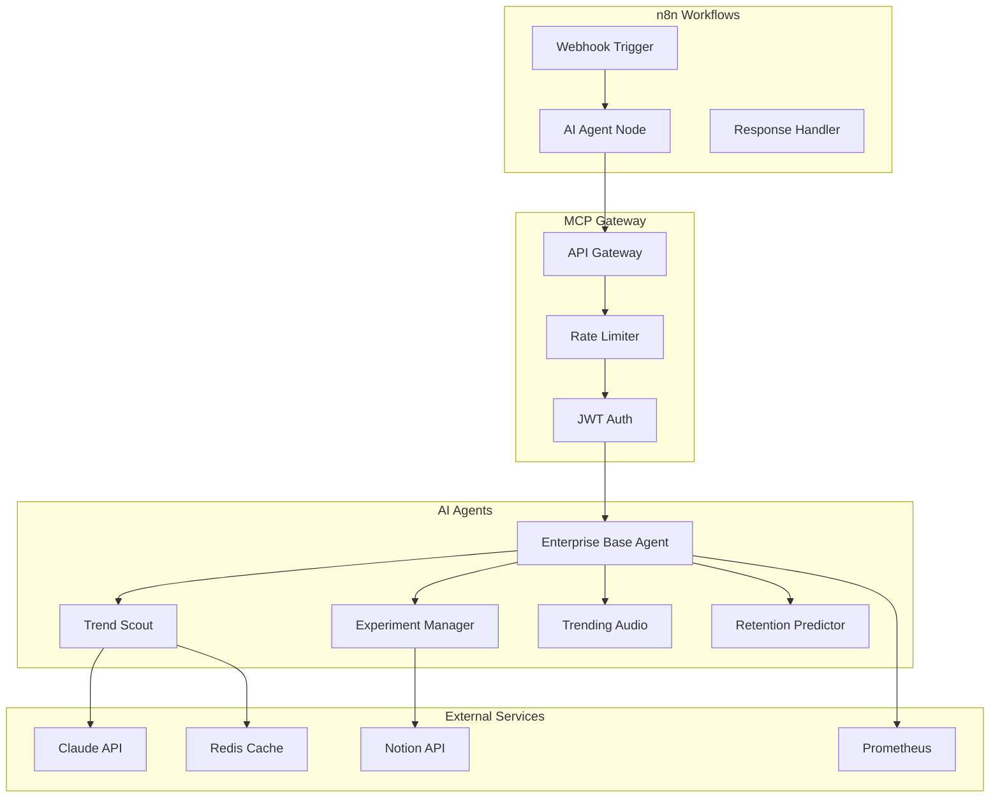

# AI Agent Installation & Configuration Guide

This guide covers the installation and configuration of AI agents following Anthropic enterprise best practices and n8n AI integration patterns.

## Table of Contents

1. [Architecture Overview](#architecture-overview)
2. [Prerequisites](#prerequisites)
3. [Base Agent Installation](#base-agent-installation)
4. [Agent-Specific Configuration](#agent-specific-configuration)
5. [n8n Integration](#n8n-integration)
6. [Monitoring & Observability](#monitoring-observability)
7. [Troubleshooting](#troubleshooting)

## Architecture Overview



## Prerequisites

### Required Services

1. **Kubernetes Cluster** (1.30+)
   - MCP namespace created
   - RBAC configured

2. **Redis Cluster** (7.0+)
   - Stream support enabled
   - ACL configured for agents

3. **API Keys**
   ```bash
   # Required environment variables
   ANTHROPIC_API_KEY=sk-ant-...
   OPENAI_API_KEY=sk-...  # For some agents
   NOTION_API_KEY=secret_...
   ```

4. **n8n Instance** (1.19.0+)
   - Queue mode enabled
   - MCP webhook access configured

### Resource Requirements

| Agent | CPU | Memory | GPU | Storage |
|-------|-----|--------|-----|---------|
| Trend Scout | 0.5-2 | 1-2Gi | No | 10Gi |
| Experiment Manager | 0.5-1 | 1Gi | No | 5Gi |
| Trending Audio | 0.5-1 | 1Gi | No | 20Gi |
| Retention Predictor | 1-4 | 2-4Gi | Optional | 50Gi |

## Base Agent Installation

### 1. Create Base ConfigMap

```yaml
apiVersion: v1
kind: ConfigMap
metadata:
  name: agent-base-config
  namespace: mcp
data:
  enterprise_config.yaml: |
    monitoring:
      prometheus_port: 2112
      jaeger_endpoint: "http://jaeger-collector.monitoring:14268"
      log_level: INFO
    
    redis:
      host: redis-cluster.grayghostai
      port: 6379
      stream_key: "mcp:events"
      ttl_days: 7
    
    anthropic:
      model: claude-3-sonnet-20240229
      max_tokens: 4096
      temperature: 0.7
      retry_attempts: 3
      retry_delay_ms: 1000
    
    n8n:
      webhook_base: "http://n8n:5678/webhook"
      timeout_seconds: 300
```

### 2. Create Secrets

```bash
# Create agent secrets
kubectl create secret generic agent-api-keys \
  --namespace=mcp \
  --from-literal=ANTHROPIC_API_KEY=$ANTHROPIC_API_KEY \
  --from-literal=OPENAI_API_KEY=$OPENAI_API_KEY \
  --from-literal=NOTION_API_KEY=$NOTION_API_KEY \
  --from-literal=REDIS_PASSWORD=$REDIS_PASSWORD
```

### 3. Deploy Base Agent Image

```dockerfile
# Base Dockerfile for all agents
FROM python:3.11-slim

# Install base dependencies
RUN apt-get update && apt-get install -y \
    ca-certificates \
    curl \
    git \
    && rm -rf /var/lib/apt/lists/*

# Create agent user
RUN useradd -m -s /bin/bash agent

# Install Python base packages
COPY requirements-base.txt /tmp/
RUN pip install --no-cache-dir -r /tmp/requirements-base.txt

# Copy base agent code
COPY agents/base /app/base

# Set working directory
WORKDIR /app

# Switch to agent user
USER agent

# Health check
HEALTHCHECK --interval=30s --timeout=3s \
    CMD curl -f http://localhost:8080/health || exit 1
```

## Agent-Specific Configuration

### Trend Scout Agent

```yaml
apiVersion: apps/v1
kind: Deployment
metadata:
  name: trend-scout-agent
  namespace: mcp
spec:
  replicas: 2
  selector:
    matchLabels:
      app: trend-scout
  template:
    metadata:
      labels:
        app: trend-scout
        agent-type: content-discovery
      annotations:
        prometheus.io/scrape: "true"
        prometheus.io/port: "2112"
    spec:
      serviceAccountName: mcp-agent
      containers:
      - name: agent
        image: ghcr.io/ggdc/trend-scout:v2.0.0
        ports:
        - containerPort: 8080
          name: http
        - containerPort: 2112
          name: metrics
        env:
        - name: AGENT_ID
          value: trend-scout
        - name: TREND_API_QUOTA
          value: "1000"
        - name: TREND_CACHE_TTL
          value: "3600"
        envFrom:
        - secretRef:
            name: agent-api-keys
        - configMapRef:
            name: agent-base-config
        resources:
          requests:
            cpu: 500m
            memory: 1Gi
          limits:
            cpu: 2
            memory: 2Gi
        livenessProbe:
          httpGet:
            path: /health
            port: 8080
          initialDelaySeconds: 30
          periodSeconds: 30
        readinessProbe:
          httpGet:
            path: /ready
            port: 8080
          initialDelaySeconds: 10
          periodSeconds: 10
```

### Experiment Manager Agent

```yaml
apiVersion: apps/v1
kind: Deployment
metadata:
  name: experiment-manager-agent
  namespace: mcp
spec:
  replicas: 1
  selector:
    matchLabels:
      app: experiment-manager
  template:
    metadata:
      labels:
        app: experiment-manager
        agent-type: optimization
    spec:
      containers:
      - name: agent
        image: ghcr.io/ggdc/experiment-manager:v2.0.0
        env:
        - name: AGENT_ID
          value: experiment-manager
        - name: EXPERIMENT_DURATION_HOURS
          value: "2"
        - name: MIN_SAMPLE_SIZE
          value: "100"
        - name: CONFIDENCE_THRESHOLD
          value: "0.95"
```

### Retention Predictor Agent (with GPU)

```yaml
apiVersion: apps/v1
kind: Deployment
metadata:
  name: retention-predictor-agent
  namespace: mcp
spec:
  replicas: 1
  selector:
    matchLabels:
      app: retention-predictor
  template:
    metadata:
      labels:
        app: retention-predictor
        agent-type: ml-prediction
    spec:
      nodeSelector:
        nvidia.com/gpu: "true"
      containers:
      - name: agent
        image: ghcr.io/ggdc/retention-predictor:v2.0.0
        env:
        - name: AGENT_ID
          value: retention-predictor
        - name: MODEL_PATH
          value: "/models/retention_model.pkl"
        - name: RETENTION_THRESHOLD
          value: "0.65"
        - name: MODEL_UPDATE_SCHEDULE
          value: "0 2 * * 0"  # Weekly at 2 AM Sunday
        resources:
          requests:
            cpu: 1
            memory: 2Gi
            nvidia.com/gpu: 1
          limits:
            cpu: 4
            memory: 4Gi
            nvidia.com/gpu: 1
        volumeMounts:
        - name: model-storage
          mountPath: /models
      volumes:
      - name: model-storage
        persistentVolumeClaim:
          claimName: ml-models-pvc
```

## n8n Integration

### 1. Install n8n AI Nodes

```bash
# In n8n container
npm install @n8n/n8n-nodes-langchain
```

### 2. Configure AI Agent Credentials

Create in n8n UI under Credentials:

```json
{
  "name": "MCP AI Agents",
  "type": "httpBasicAuth",
  "data": {
    "user": "n8n-workflow",
    "password": "{{ $env.MCP_AGENT_PASSWORD }}"
  }
}
```

### 3. Create Agent Integration Workflow

```javascript
// n8n Code node for agent integration
const agentEndpoints = {
  'trend-scout': 'http://mcp-gateway.mcp:8080/agents/trend-scout',
  'experiment-manager': 'http://mcp-gateway.mcp:8080/agents/experiment-manager',
  'retention-predictor': 'http://mcp-gateway.mcp:8080/agents/retention-predictor'
};

const agent = $input.first().json.agent || 'trend-scout';
const action = $input.first().json.action || 'discover_trends';

const requestBody = {
  action: action,
  data: $input.first().json.data || {},
  context: {
    workflow_id: $workflow.id,
    execution_id: $execution.id,
    timestamp: new Date().toISOString()
  },
  webhook_url: `${$env.N8N_WEBHOOK_URL}/agent-response/${$execution.id}`
};

return {
  json: requestBody,
  agent_endpoint: agentEndpoints[agent]
};
```

### 4. Import Workflow Templates

```bash
# Import pre-configured workflows
n8n import:workflow \
  --input=workflows/n8n-ai-templates/trend-discovery-workflow.json \
  --separate

n8n import:workflow \
  --input=workflows/n8n-ai-templates/content-optimization-workflow.json \
  --separate
```

## Monitoring & Observability

### 1. Prometheus Metrics

```yaml
apiVersion: v1
kind: ServiceMonitor
metadata:
  name: ai-agents
  namespace: mcp
spec:
  selector:
    matchLabels:
      agent-type: ai
  endpoints:
  - port: metrics
    interval: 15s
    path: /metrics
```

### 2. Grafana Dashboard

Import dashboard from: `monitoring/dashboards/ai-agents-dashboard.json`

Key metrics:
- Request rate by agent and action
- Response time P50/P95/P99
- Error rate and types
- Claude API usage and costs
- Cache hit rates

### 3. Logging

```yaml
# Loki LogQL queries
{namespace="mcp", app=~".*-agent"} |= "ERROR"
{namespace="mcp", app="trend-scout"} |= "ANTHROPIC_API"
```

### 4. Alerts

```yaml
apiVersion: monitoring.coreos.com/v1
kind: PrometheusRule
metadata:
  name: ai-agent-alerts
  namespace: mcp
spec:
  groups:
  - name: ai-agents
    rules:
    - alert: AgentHighErrorRate
      expr: |
        rate(agent_errors_total[5m]) > 0.1
      for: 10m
      annotations:
        summary: "Agent {{ $labels.agent }} error rate above 10%"
    
    - alert: ClaudeAPIQuotaExhausted
      expr: |
        anthropic_api_remaining_quota < 100
      for: 5m
      annotations:
        summary: "Claude API quota running low"
```

## Troubleshooting

### Common Issues

#### 1. Agent Timeout Errors

```bash
# Check agent logs
kubectl logs -n mcp deployment/trend-scout-agent

# Increase timeout in deployment
kubectl set env deployment/trend-scout-agent TIMEOUT_SECONDS=600
```

#### 2. Claude API Rate Limits

```bash
# Check current usage
kubectl exec -n mcp deployment/trend-scout-agent -- \
  curl http://localhost:2112/metrics | grep anthropic

# Implement backoff
kubectl patch deployment/trend-scout-agent -n mcp \
  --patch '{"spec":{"template":{"spec":{"containers":[{"name":"agent","env":[{"name":"RETRY_DELAY_MS","value":"5000"}]}]}}}}'
```

#### 3. Redis Connection Issues

```bash
# Test Redis connectivity
kubectl run redis-test --rm -it --image=redis:7 -- \
  redis-cli -h redis-cluster.grayghostai -a $REDIS_PASSWORD ping

# Check Redis stream
kubectl exec -n grayghostai redis-cluster-0 -- \
  redis-cli XINFO STREAM mcp:events
```

#### 4. n8n Webhook Failures

```bash
# Test webhook endpoint
kubectl exec -n mcp deployment/trend-scout-agent -- \
  curl -X POST http://n8n:5678/webhook/test \
  -H "Content-Type: application/json" \
  -d '{"test": true}'

# Check n8n logs
kubectl logs -n grayghostai deployment/n8n | grep webhook
```

### Debug Mode

Enable debug logging:

```bash
kubectl set env deployment/trend-scout-agent \
  LOG_LEVEL=DEBUG \
  ANTHROPIC_DEBUG=true
```

### Performance Tuning

```yaml
# Optimize for high throughput
env:
- name: WORKER_THREADS
  value: "4"
- name: REDIS_POOL_SIZE
  value: "20"
- name: HTTP_KEEPALIVE
  value: "true"
- name: HTTP_TIMEOUT
  value: "30000"
```

## Best Practices

1. **Always use structured prompts** with XML tags for Claude
2. **Implement retry logic** with exponential backoff
3. **Cache expensive operations** in Redis
4. **Monitor API usage** to avoid quota exhaustion
5. **Use async operations** for better performance
6. **Implement circuit breakers** for external services
7. **Version your prompts** for A/B testing
8. **Log all API calls** for debugging and cost tracking

## Security Considerations

1. **Rotate API keys** every 90 days
2. **Use separate keys** per environment
3. **Implement rate limiting** at agent level
4. **Sanitize all inputs** before sending to Claude
5. **Encrypt sensitive data** in Redis
6. **Audit all agent actions** in centralized logging

## Scaling Guidelines

| Metric | Threshold | Action |
|--------|-----------|--------|
| CPU > 80% | 5 minutes | Scale horizontally |
| Memory > 85% | 5 minutes | Increase limits |
| Queue depth > 1000 | 1 minute | Add workers |
| Response time > 5s | 10 minutes | Check external APIs |

## Conclusion

This installation guide provides a complete setup for AI agents following enterprise best practices. Regular monitoring and maintenance ensure optimal performance and reliability.