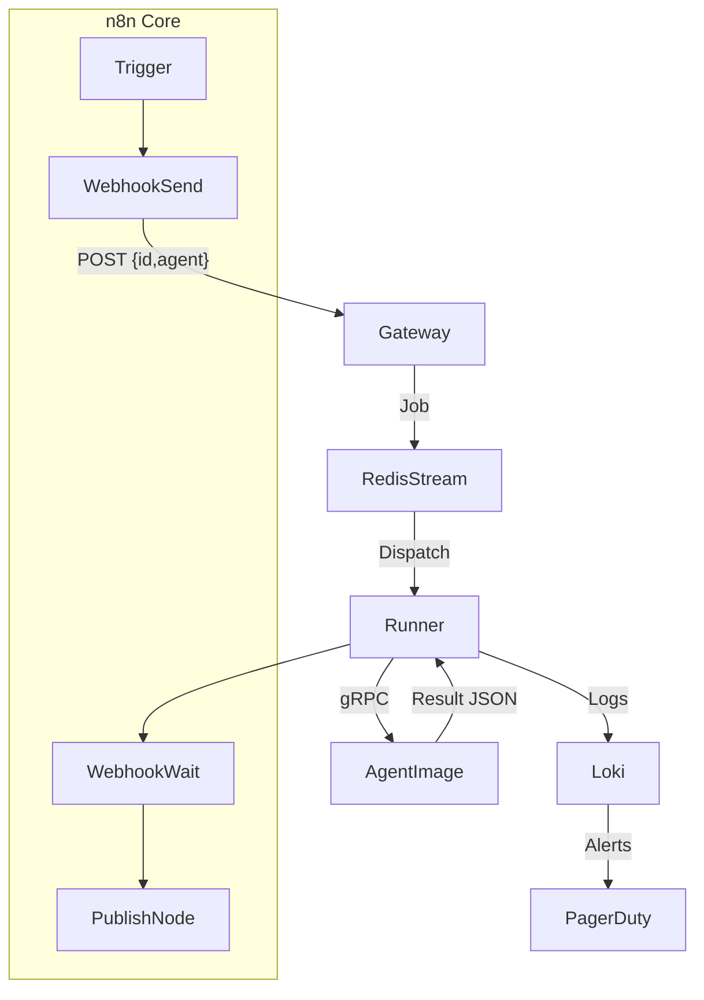

# Mission Control Plane (MCP) Implementation Guide

## Overview

The Mission Control Plane (MCP) is a multi-agent content automation fabric that replaces n8n nodes with intelligent, scalable agents. It provides a secure, GPU-accelerated platform for content generation, brand compliance, and automated publishing.

## Architecture



## Core Components

### 1. MCP Gateway (`mcp-gateway`)
- **Purpose**: API gateway with JWT validation and rate limiting
- **Features**:
  - Per-agent QPS limits
  - OpenTelemetry B3 tracing
  - Redis stream integration
  - Health checks and metrics
- **Ports**: 443 (REST), 8080 (gRPC)
- **Scaling**: 2-10 replicas (HPA)

### 2. Agent Registry (`agent-registry`)
- **Purpose**: Central registry for agent manifests
- **Features**:
  - Agent discovery
  - Capability mapping
  - Version management
  - Resource requirements
- **Port**: 7000
- **Scaling**: Single replica (stateless)

### 3. Agent Runner (`agent-runner`)
- **Purpose**: Executes agents in Firecracker micro-VMs
- **Features**:
  - CPU and GPU variants
  - Cosign image verification
  - tmpfs for PII isolation
  - Resource limits enforcement
- **Types**:
  - CPU runners: 3-20 replicas
  - GPU runners: 0-4 replicas (on-demand)
- **Port**: 9000 (gRPC)

### 4. Vector Store (`vector-store`)
- **Purpose**: pgvector database for embeddings and memory
- **Features**:
  - HNSW indexing for <50ms retrieval
  - Agent memory management
  - A/B test results storage
  - Content deduplication
- **Tech**: PostgreSQL 15 with pgvector
- **HA**: 2-node Patroni cluster

### 5. State Controller (`state-controller`)
- **Purpose**: Manages content lifecycle state machine
- **States**: Idea → Draft → Review → Approved → Scheduled → Published → Analyzing → Retired
- **Features**:
  - Redis-backed state persistence
  - Notion integration
  - Slack notifications
  - Timeout handling

## Agent Catalogue

| # | Agent | Purpose | GPU Required |
|---|-------|---------|--------------|
| 1 | Trend Scout | RSS/Twitter/Trends ingestion | No |
| 2 | Audience Cluster | K-means clustering & stats | No |
| 3 | Content Strategist | Local angle & brand alignment | No |
| 4 | Hook-Crafter | Copywriting (≤55 chars) | No |
| 5 | Narrative Storyboard | 15/30/60s scripts | No |
| 6 | Visual-Composer | Canva template generation | Yes |
| 7 | Dub-& Caption | Whisper/Polly/WCAG captions | Yes |
| 8 | Brand-Sentinel | Pixel-diff & font validation | No |
| 9 | PII-Guardian | Privacy classification & encryption | Yes |
| 10 | Publishing Herald | Multi-platform publishing | No |
| 11 | Window-Optimizer | ML-based posting time | No |
| 12 | Boost-Governor | Ad campaign management | No |
| 13 | Anomaly-Watcher | Monitoring & alerting | No |
| 14 | Incident-Narrator | Incident documentation | No |
| 15 | Analytics Analyst | KPI extraction to BigQuery | No |

## Security Features

### Image Verification
- All images signed with Cosign
- Kyverno policies enforce signature verification
- SBOM generation for supply chain security

### PII Protection
- Tier-2 background checks for admins
- Field-level encryption for High-impact PII
- tmpfs volumes prevent data residue
- Automatic PII classification and tagging

### Network Isolation
- Default deny-all NetworkPolicies
- Egress restricted to approved endpoints
- mTLS between components (pending)
- WAF integration for external access

### Runtime Security
- Falco rules for container monitoring (pending)
- PodSecurityPolicies enforced
- Read-only root filesystems
- Non-root user execution (except Firecracker)

## Deployment

### Prerequisites
- Kubernetes 1.30+
- GPU nodes with NVIDIA drivers
- Vault for secret management
- Redis cluster with ACL support
- pgvector-enabled PostgreSQL

### Installation

1. **Create namespace and base resources**:
```bash
kubectl apply -f infra/k8s/base/mcp/namespace.yaml
```

2. **Deploy core components**:
```bash
kubectl apply -k infra/k8s/base/mcp/
```

3. **Configure Vault policies**:
```bash
vault policy write mcp-gateway vault-mcp-policies/mcp-gateway-policy.hcl
vault policy write agent-runner vault-mcp-policies/agent-runner-policy.hcl
```

4. **Verify deployment**:
```bash
kubectl get pods -n mcp
kubectl get hpa -n mcp
```

### Environment-Specific Configuration

- **Dev**: Minimal resources, 1 replica each
- **Staging**: Production-like with reduced scale
- **Production**: Full HA, GPU autoscaling, PDBs

## Integration with n8n

### Bridge Component
The `n8n-mcp-bridge` translates n8n webhook calls to MCP agent invocations:
- Maps legacy nodes to new agents
- Handles authentication and retry logic
- Provides backward compatibility

### Custom n8n Node
A new "MCP Agent" node is available in n8n for direct agent execution:
- Agent selection dropdown
- Synchronous/asynchronous modes
- Result transformation

## Monitoring & Observability

### Metrics
- Agent execution duration
- Queue depth and latency
- GPU utilization
- Error rates by agent

### Dashboards
- System overview
- Agent performance
- Cost attribution
- Brand compliance scores

### Alerts
- Queue backup > 5000 items
- GPU utilization > 65%
- Agent failure rate > 5%
- PII exposure attempts

## Cost Optimization

### GPU Scaling
- Scale-to-zero when idle
- Batch GPU-intensive tasks
- 10-minute scale-down delay

### Resource Limits
- CPU/memory limits enforced
- Automatic pod eviction on OOM
- Request/limit ratios optimized

### FinOps Integration
- Per-agent cost tracking
- Budget alerts at 80%
- Daily cost reports

## Troubleshooting

### Common Issues

1. **Agent timeout**:
   - Check Redis stream length
   - Verify runner availability
   - Review agent logs in Loki

2. **Image pull failures**:
   - Verify Cosign signatures
   - Check registry credentials
   - Review Kyverno policy violations

3. **State machine stuck**:
   - Check Redis connectivity
   - Review state controller logs
   - Verify Notion/Slack webhooks

### Debug Commands

```bash
# Check agent status
kubectl logs -n mcp deployment/agent-runner-cpu -f

# View Redis stream
kubectl exec -n grayghostai redis-cluster-0 -- redis-cli XLEN mcp:events

# Test agent execution
kubectl run test-agent --rm -i --restart=Never --image=curlimages/curl -n mcp -- \
  curl -X POST http://mcp-gateway:8080/agents/trend-scout \
  -H "Authorization: Bearer $TOKEN" \
  -d '{"sources": ["krebs", "darknet"]}'
```

## Roadmap

### Sprint +1 (Current)
- ✅ Core MCP infrastructure
- ✅ Gateway, registry, runners
- ✅ Basic agents (1-3)

### Sprint +2
- Vector store HA improvements
- GPU runner optimization
- Visual generation agents (4-9)

### Sprint +3
- PII encryption integration
- Legal review automation
- Publishing agents (10-12)

### Sprint +4
- Cross-region failover
- Chaos engineering tests
- Analytics agents (13-15)

### Sprint +5
- mTLS everywhere
- FinOps dashboard
- ML model versioning