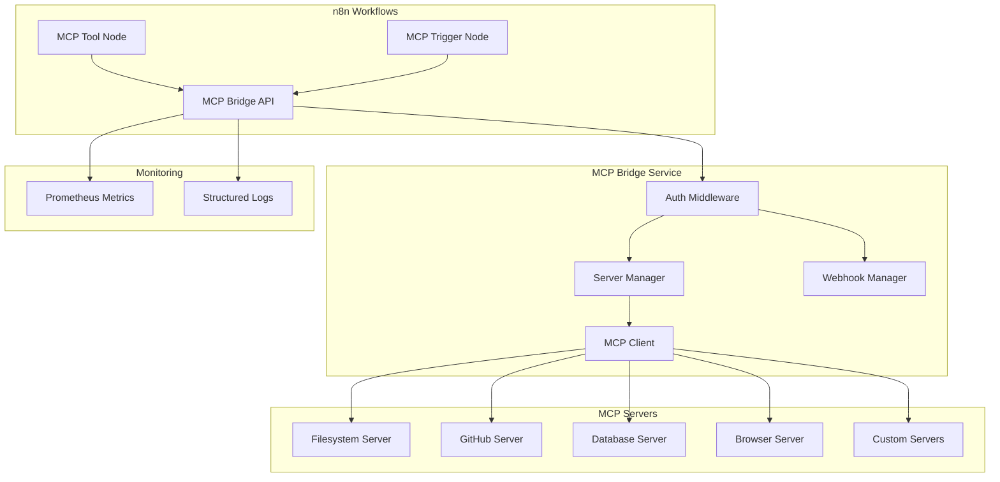

# MCP (Model Context Protocol) Integration for n8n

This document describes the MCP integration for n8n, enabling AI agents to execute tools from various MCP servers within n8n workflows.

## Table of Contents

1. [Overview](#overview)
2. [Architecture](#architecture)
3. [Components](#components)
4. [Installation](#installation)
5. [Configuration](#configuration)
6. [Usage Examples](#usage-examples)
7. [Security](#security)
8. [Monitoring](#monitoring)
9. [Troubleshooting](#troubleshooting)

## Overview

The MCP integration enables n8n workflows to:
- Execute tools from any MCP-compatible server
- Integrate with AI assistants and language models
- Access external services through a standardized protocol
- Trigger workflows based on MCP events

### Key Features

- **Dynamic Tool Discovery**: Automatically discover available tools from connected MCP servers
- **Multiple Server Support**: Connect to multiple MCP servers simultaneously
- **Event-Driven Workflows**: Trigger workflows based on MCP events
- **Secure Communication**: JWT-based authentication and rate limiting
- **High Availability**: Kubernetes-native deployment with auto-scaling
- **Comprehensive Monitoring**: Prometheus metrics and structured logging

## Architecture



## Components

### 1. n8n Custom Nodes

#### MCP Tool Node (`MCPTool.node.ts`)
- Execute tools from MCP servers
- Dynamic server and tool selection
- Configurable retry logic
- Support for raw and processed output

#### MCP Tool Trigger (`MCPToolTrigger.node.ts`)
- Webhook-based event triggers
- Event filtering capabilities
- Batch event support
- Customizable event data

#### MCP API Credentials (`MCPApi.credentials.ts`)
- Secure API key management
- Environment-specific configuration
- Custom header support

### 2. MCP Bridge Service

A Node.js/TypeScript microservice that acts as a bridge between n8n and MCP servers.

#### Features:
- **Multi-Server Management**: Connect to multiple MCP servers
- **Tool Execution**: Execute tools with timeout and retry logic
- **Webhook Management**: Event-driven architecture
- **Authentication**: JWT-based API authentication
- **Rate Limiting**: Protect against abuse
- **Metrics Collection**: Prometheus-compatible metrics
- **Health Checks**: Kubernetes-ready health endpoints

### 3. Supported MCP Servers

Out of the box support for:
- **Filesystem**: File system operations
- **GitHub**: Repository management
- **PostgreSQL**: Database queries
- **Web Browser**: Browser automation (Puppeteer)
- **Slack**: Workspace integration
- **Custom**: Any MCP-compatible server

## Installation

### Prerequisites

1. n8n instance (v1.19.0+)
2. Kubernetes cluster (1.28+)
3. Docker registry access

### Step 1: Deploy MCP Bridge Service

```bash
# Create namespace
kubectl create namespace mcp

# Apply Kubernetes manifests
kubectl apply -f infra/k8s/base/mcp-bridge-deployment.yaml

# Verify deployment
kubectl get pods -n mcp
kubectl get svc -n mcp
```

### Step 2: Install n8n Nodes

```bash
# In your n8n instance
cd /usr/local/lib/node_modules/n8n
npm install @grayghostai/n8n-nodes-grayghostai

# Restart n8n
pm2 restart n8n
```

### Step 3: Configure Credentials

1. In n8n UI, go to **Credentials** > **New**
2. Select "MCP API"
3. Configure:
   ```json
   {
     "apiKey": "your-jwt-token",
     "baseUrl": "http://mcp-bridge.mcp:3000",
     "environment": "production"
   }
   ```

### Step 4: Generate API Keys

```bash
# Generate JWT token for n8n
kubectl exec -n mcp deployment/mcp-bridge -- \
  node -e "
    const jwt = require('jsonwebtoken');
    const token = jwt.sign({
      apiKeyId: 'n8n-prod-001',
      scopes: ['tools:execute', 'servers:read', 'webhooks:manage']
    }, process.env.JWT_SECRET, { expiresIn: '365d' });
    console.log(token);
  "
```

## Configuration

### MCP Server Configuration

Edit the ConfigMap to add custom MCP servers:

```yaml
apiVersion: v1
kind: ConfigMap
metadata:
  name: mcp-bridge-config
  namespace: mcp
data:
  mcp-servers.json: |
    [
      {
        "id": "custom-server",
        "name": "My Custom MCP Server",
        "type": "websocket",
        "url": "ws://custom-mcp-server:8080",
        "description": "Custom business logic"
      }
    ]
```

### Environment Variables

| Variable | Description | Default |
|----------|-------------|---------|
| `PORT` | Service port | 3000 |
| `LOG_LEVEL` | Logging level | info |
| `CORS_ORIGINS` | Allowed origins | * |
| `JWT_SECRET` | JWT signing secret | (required) |
| `MCP_SERVERS` | Server configurations | [] |

## Usage Examples

### Example 1: Execute GitHub Tool

```json
{
  "nodes": [
    {
      "name": "MCP Tool",
      "type": "@grayghostai/n8n-nodes-grayghostai.mcpTool",
      "position": [450, 300],
      "parameters": {
        "server": "github",
        "tool": "create_issue",
        "parameters": {
          "owner": "myorg",
          "repo": "myrepo",
          "title": "New Feature Request",
          "body": "Description of the feature"
        },
        "options": {
          "timeout": 30000,
          "retryOnFailure": true,
          "includeMetadata": true
        }
      }
    }
  ]
}
```

### Example 2: File System Operations

```json
{
  "nodes": [
    {
      "name": "Read File",
      "type": "@grayghostai/n8n-nodes-grayghostai.mcpTool",
      "parameters": {
        "server": "filesystem",
        "tool": "read_file",
        "parameters": {
          "path": "/data/config.json"
        }
      }
    },
    {
      "name": "Process Data",
      "type": "n8n-nodes-base.function",
      "position": [650, 300],
      "parameters": {
        "functionCode": "const config = JSON.parse($input.first().json.result);\nreturn [{ json: { processed: true, ...config } }];"
      }
    }
  ]
}
```

### Example 3: Event-Driven Workflow

```json
{
  "nodes": [
    {
      "name": "MCP Event Trigger",
      "type": "@grayghostai/n8n-nodes-grayghostai.mcpToolTrigger",
      "position": [250, 300],
      "parameters": {
        "event": "tool_completed",
        "filters": {
          "server": "github",
          "successOnly": true
        }
      }
    },
    {
      "name": "Send Notification",
      "type": "n8n-nodes-base.slack",
      "position": [450, 300],
      "parameters": {
        "channel": "#dev-notifications",
        "text": "GitHub operation completed: {{$json.tool}}"
      }
    }
  ]
}
```

### Example 4: AI Assistant Integration

```json
{
  "nodes": [
    {
      "name": "User Request",
      "type": "n8n-nodes-base.webhook",
      "position": [250, 300],
      "webhookId": "user-request"
    },
    {
      "name": "Claude",
      "type": "n8n-nodes-langchain.llm",
      "position": [450, 300],
      "parameters": {
        "model": "claude-3-opus",
        "prompt": "User request: {{$json.query}}\n\nAvailable tools: filesystem, github, database\n\nWhat tool should I use?"
      }
    },
    {
      "name": "Execute Tool",
      "type": "@grayghostai/n8n-nodes-grayghostai.mcpTool",
      "position": [650, 300],
      "parameters": {
        "server": "={{$json.suggested_server}}",
        "tool": "={{$json.suggested_tool}}",
        "parameters": "={{$json.tool_parameters}}"
      }
    }
  ]
}
```

## Security

### Authentication

The MCP Bridge uses JWT tokens for authentication:

```javascript
// Generate a token
const jwt = require('jsonwebtoken');
const token = jwt.sign({
  apiKeyId: 'client-id',
  scopes: ['tools:execute', 'servers:read']
}, SECRET, { expiresIn: '30d' });
```

### Network Policies

The deployment includes NetworkPolicies that:
- Allow ingress only from n8n namespace
- Restrict egress to necessary ports
- Enable monitoring access

### Rate Limiting

Default rate limits:
- 100 requests per minute per IP
- Configurable via environment variables

## Monitoring

### Prometheus Metrics

Available metrics:
- `http_request_duration_seconds`: HTTP request latency
- `http_requests_total`: Total HTTP requests
- `mcp_tool_executions_total`: Tool execution count
- `mcp_tool_duration_seconds`: Tool execution duration

### Grafana Dashboard

Import the dashboard from `monitoring/dashboards/mcp-bridge.json`:

```bash
kubectl create configmap mcp-bridge-dashboard \
  --from-file=monitoring/dashboards/mcp-bridge.json \
  -n monitoring
```

### Logging

Structured JSON logs with:
- Execution IDs for tracing
- Server and tool information
- Performance metrics
- Error details

## Troubleshooting

### Common Issues

#### 1. Connection Failed to MCP Server

```bash
# Check server logs
kubectl logs -n mcp deployment/mcp-bridge | grep "server-id"

# Verify server configuration
kubectl get cm -n mcp mcp-bridge-config -o yaml
```

#### 2. Authentication Errors

```bash
# Verify JWT token
jwt decode YOUR_TOKEN

# Check secret configuration
kubectl get secret -n mcp mcp-bridge-secret -o yaml
```

#### 3. Tool Execution Timeout

```javascript
// Increase timeout in node parameters
{
  "options": {
    "timeout": 60000  // 60 seconds
  }
}
```

#### 4. Webhook Not Triggering

```bash
# List registered webhooks
curl -H "Authorization: Bearer YOUR_TOKEN" \
  http://mcp-bridge.mcp:3000/api/webhooks

# Test webhook manually
curl -X POST http://n8n:5678/webhook/test-webhook-id \
  -H "Content-Type: application/json" \
  -d '{"test": true}'
```

### Debug Mode

Enable debug logging:

```bash
kubectl set env -n mcp deployment/mcp-bridge LOG_LEVEL=debug
```

### Performance Tuning

1. **Increase replicas** for high load:
   ```bash
   kubectl scale -n mcp deployment/mcp-bridge --replicas=5
   ```

2. **Adjust resource limits**:
   ```yaml
   resources:
     requests:
       memory: "1Gi"
       cpu: "500m"
     limits:
       memory: "2Gi"
       cpu: "1000m"
   ```

3. **Configure connection pooling** for MCP servers

## Support

- GitHub Issues: https://github.com/ggdc/mcp-n8n-integration/issues
- Documentation: https://docs.grayghostai.com/integrations/mcp
- n8n Community: https://community.n8n.io