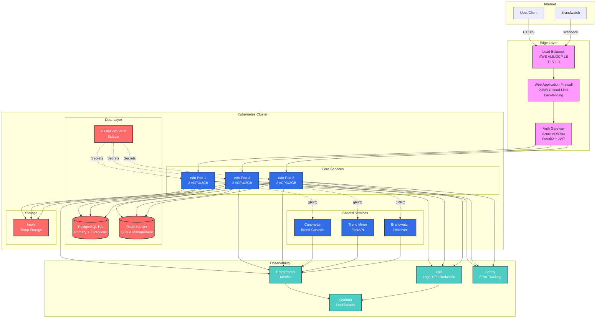
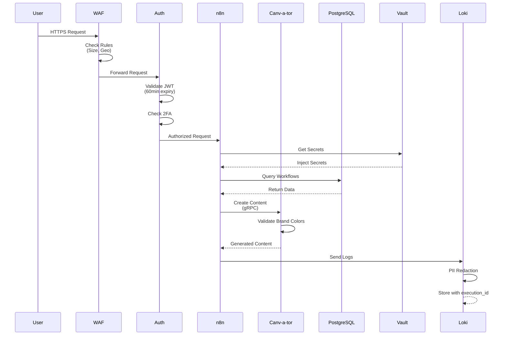
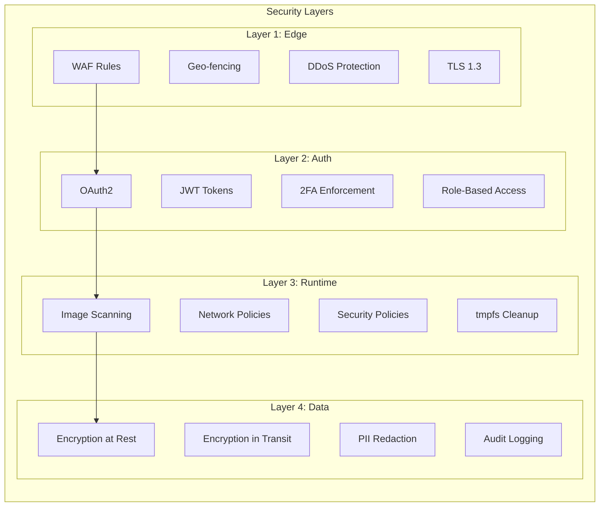
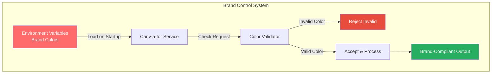
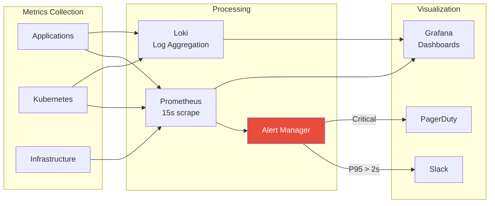
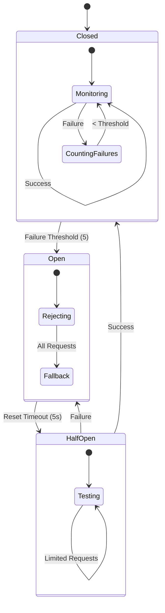

# GrayGhostAI Platform Architecture Diagram

## System Architecture Overview

## Data Flow Diagram

## Security Architecture

## Brand Control Flow

## Monitoring & Alerting Flow

## Circuit Breaker Pattern

